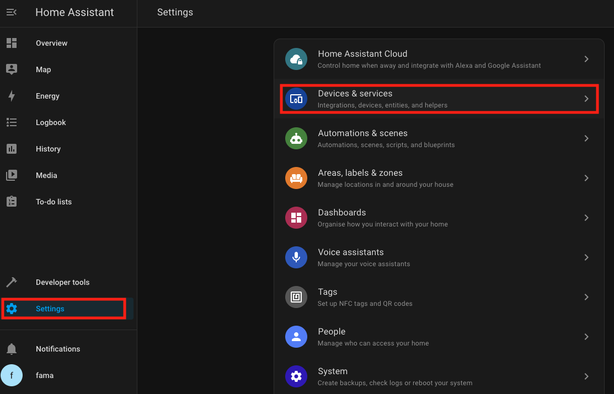
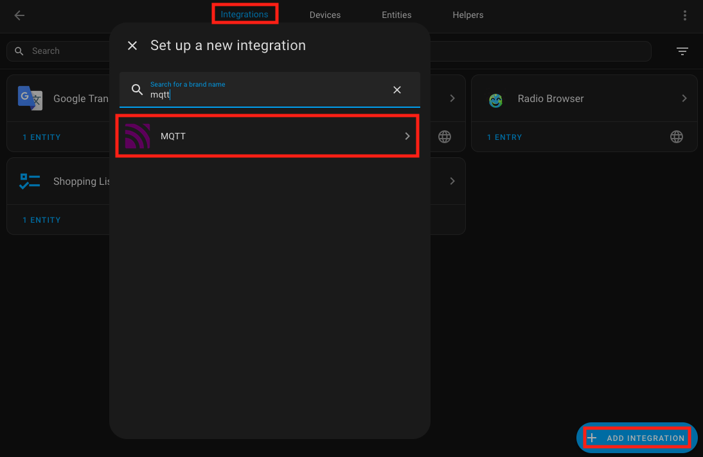
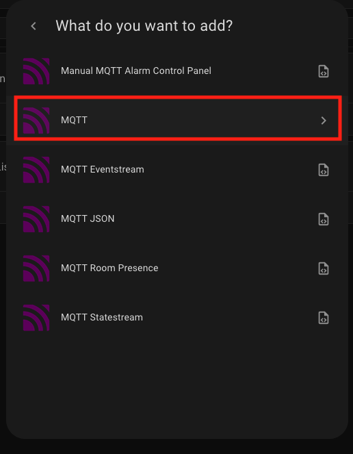
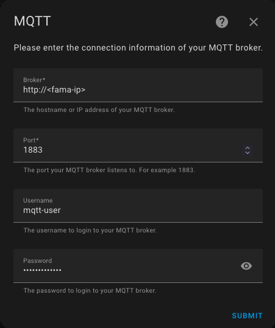
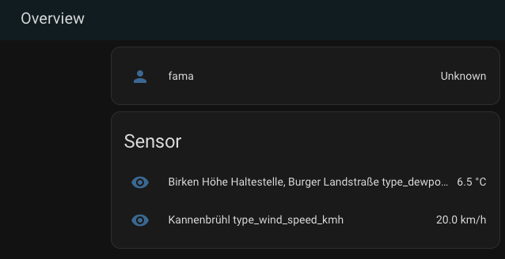

# Home Assistant

This guide explains how to integrate the Open SmartCity Home application with Home Assistant using MQTT for seamless sensor data integration.

## Prerequisites

Ensure you have a running instance of Home Assistant to integrate sensor data from the Open SmartCity Home application.

Ensure Home Assistant is updated to the latest version for compatibility with MQTT integration.

You can find the official Home Assistant documentation at the following link:
[Home Assistant Documentation](https://www.home-assistant.io/docs/)

This site contains detailed guides, tutorials, and information about installation, configuration, and integrations.

## Setting Up Open SmartCity Home as a Home Assistant Addon

Click on the button below:

[](https://my.home-assistant.io/redirect/supervisor_add_addon_repository/?repository_url=https://github.com/nedeco/fama-hass-addons)

## Setting Up Open Smart City Home with Docker

Open Smart City Home can be deployed using Docker, either with a simple `docker run` command or using `docker-compose` for more complex setups.

### Prerequisites
Before running Open Smart City Home, ensure you have the following installed:
- Docker ([Installation Guide](https://docs.docker.com/get-docker/))
- Docker Compose (if using `docker-compose.yml` setup)
- A home automation system (Home Assistant, OpenHAB, or ioBroker)

## Running Open Smart City Home with `docker run`
You can start Open Smart City Home with a single `docker run` command, passing the required environment variables:

```sh
docker run -d --name open-smartcity-home \
  -e SMART_HOME_TYPE=HA \
  -e MQTT_USERNAME=my_mqtt_user \
  -e MQTT_PASSWORD=my_mqtt_password \
  klingenstadt/open-smartcity-home
```

## Running Open Smart City Home with Docker Compose
For more flexibility, you can use a `docker-compose.yml` file:

```yaml
services:
  open-smartcity-home:
    image: klingenstadt/open-smartcity-home
    container_name: open-smartcity-home
    restart: unless-stopped
    ports:
      - 1883:1883
    environment:
      SMART_HOME_TYPE: "HA"
      MQTT_USERNAME: "my_mqtt_user"
      MQTT_PASSWORD: "my_mqtt_password"
```

To start Open Smart City Home using Docker Compose, run:
```sh
docker-compose up -d
```

## Environment Variables
Open Smart City Home requires several environment variables to function correctly. Below is a list of the key variables:

| Variable | Description |
|----------|-------------|
| `SMART_HOME_TYPE` | Type of home automation system (`HA` for Home Assistant/OpenHAB) |
| `MQTT_URL` | Optional External MQTT broker URL (required for Home Assistant/OpenHAB integration) |
| `MQTT_USERNAME` | MQTT broker username (required for Home Assistant/OpenHAB integration) |
| `MQTT_PASSWORD` | MQTT broker password (required for Home Assistant/OpenHAB integration) |
| `SENSOR_STATION_FILTER_IDS` | Optional Sensor Station IDs of stations which will be provided exclusively |

### Filterin by Sensor Stations

The `SENSOR_STATION_FILTER_IDS` variable needs to be a comma seperated list of station ids. If set, Open SmartCity Home will provide *only* data from these stations.

If you are using the Home Assistant Add-on you can alternatively just set the station ids in the Add-on's config.

You can find the ids [here](https://masterportal.solingen.de/portale/smartcity/?Map/layerIds=5,16,987&visibility=true,true,true&transparency=0,0,0&Map/center=%5b366111,5670646%5d&Map/zoomLevel=3&uiStyle=simple)

## Verifying the Setup
Once Open Smart City Home is running, you can verify its status using:
```sh
docker ps
```
This should display a running container named `open-smartcity-home`.

To check logs for troubleshooting:
```sh
docker logs -f open-smartcity-home
```

## MQTT Configuration

### Access Home Assistant

After completing the installation of Home Assistant, access its web interface at:
```
http://<home-assistant-ip>:8123/
```
If you are running Home Assistant locally, you can open it via [http://localhost:8123](http://localhost:8123).

### Set Up MQTT Integration in Home Assistant

1. Navigate to **Settings > Devices & Services > Add Integration**.

<p>
  
</p>

2. Search for **MQTT** and select it.

<p>
  
</p>
<p>
  
</p>

3. Configure the MQTT broker:
   - **Broker Hostname/IP:** Enter the hostname or IP address of the Open Smart City Home application's MQTT broker.
   - **Port:** Set the port to `1883`.
   - **Username:** Enter the username for the MQTT broker.
   - **Password:** Enter the corresponding password.

   Ensure the username and password match the credentials configured in the Open Smart City Home application's MQTT settings.

<p>
  
</p>

4. Click **Submit** to save the settings.

  Note: Ensure that MQTT discovery is enabled in Home Assistant. This allows Open Smart City Home's sensor data to be automatically detected and displayed.

## Conclusion

Ensure that the Open Smart City Home application is configured correctly to send MQTT messages. The MQTT username and password are required to connect to Open Smart City Home via MQTT. Once the Open Smart City Home application receives messages via the RabbitMQ, it send message via MQTT. You can verify the integration by navigating to the Devices or Entities section in Home Assistant. Sensor data should appear as newly discovered devices or entities.

<p>
  
</p>

## Troubleshooting

If you do not see sensors in your Home Assistant dashboard:

  - Verify the MQTT broker connection settings.
  - Ensure the Open Smart City Home application is configured correctly to send MQTT messages.
  - Check the Home Assistant logs for any errors related to MQTT integration.
